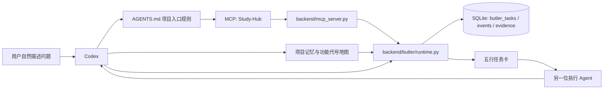
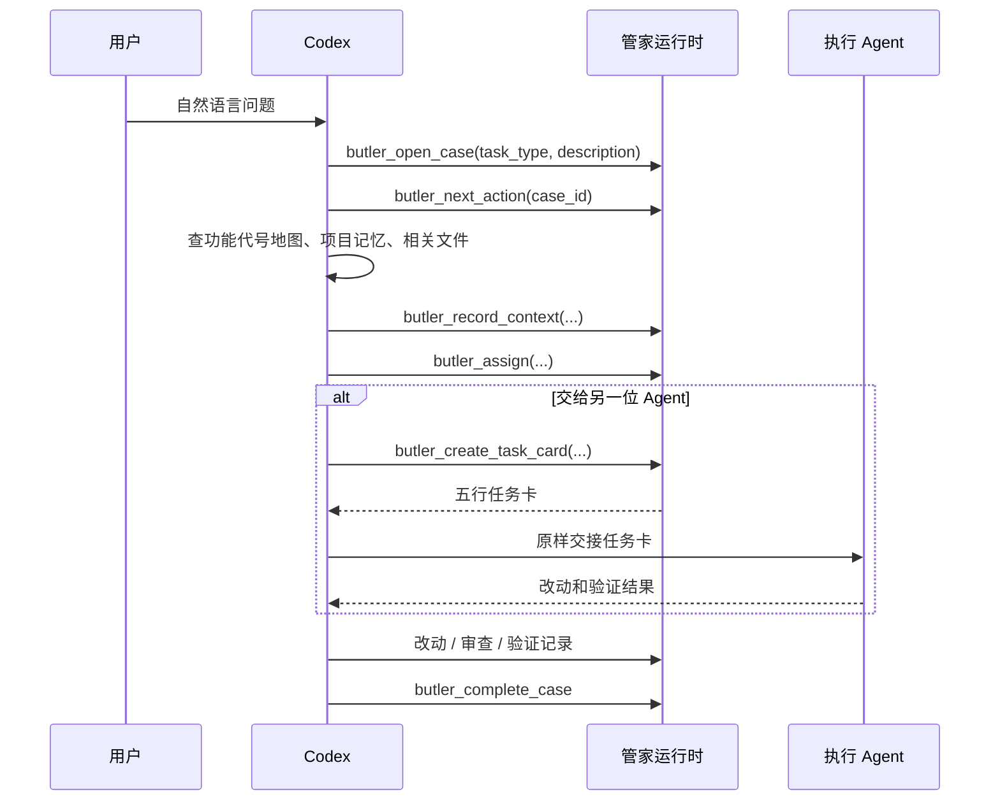

# Study-Hub 管家系统：运行逻辑与审查说明

> 文档用途：交给 Claude 做架构与实现审查。  
> 状态：按当前代码与项目规则整理，包含“已经实现”“已知限制”“建议改造”三部分；三者不可混淆。  
> 更新：2026-08-01

## 1. 产品目标

用户只在 Codex 中自然对话，不需要知道页面代号、前后端、内部角色或工具名。

管家的理想职责是：

1. 理解模糊问题并定位到项目记忆、功能代号和相关代码；
2. 把已确认事实压缩为简洁任务卡；
3. 将任务卡交给另一位执行 Agent；
4. 收回执行结果，完成审查、验证和经验沉淀；
5. 帮助 Codex 工作，而不是成为 Codex 的单点阻塞。

## 2. 当前架构



### 2.1 文件职责

| 文件 | 当前职责 |
|---|---|
| `AGENTS.md` | Codex 在本工作区的入口规则：何时登记任务、何时生成任务卡、何时确认与验收。 |
| `.claude/skills/butler/SKILL.md` | 原管家工作说明；包含记忆、角色、分派与运行时记录步骤。 |
| `.codex/config.toml` | 仅当前项目加载本地 Study-Hub MCP 服务。 |
| `study-hub/backend/mcp_server.py` | stdio MCP 服务；保留知识库等旧能力，并注册管家能力。 |
| `study-hub/backend/butler/models.py` | 任务类型、状态和状态流转规则。 |
| `study-hub/backend/butler/runtime.py` | 任务、确认、尝试、审查、验证、任务卡和记忆草稿的核心逻辑。 |
| `study-hub/backend/butler/storage.py` | SQLite 表和读写操作。 |
| `study-hub/backend/butler/mcp_tools.py` | 把运行时方法公开为 MCP 能力。 |
| `project-memory/功能代号地图.md` | 用户语言与功能位置的映射。 |

## 3. 当前真实运行流程

### 3.1 项目操作入口

当前 `AGENTS.md` 要求以下操作先进入管家：排查、修复、改动、新增、删除、检查、测试、发布、部署和项目研究。



### 3.2 任务类型（当前实现）

运行时只接受以下固定值：

| 值 | 含义 |
|---|---|
| `bug` | 故障、异常、排查与修复 |
| `change` | 功能改动 |
| `research` | 外部方案研究 |
| `health_check` | 项目健康检查 |
| `deploy` | 发布、部署与上线检查 |
| `memory_update` | 项目经验更新 |

> 重要：当前不会接受 `investigate`、`diagnose` 等值。火山引擎 ASR 案例中，`investigate` 因而被拒绝；正确的当前值应为 `bug`。

### 3.3 状态流（当前实现）

```text
received → located → investigating → implementing → auditing → verifying → completed
                     ↘ awaiting_approval ↗
任意处理中状态 → blocked / cancelled
```

- `received`：已登记；必须先记录定位信息。
- `located`：已有项目记忆/领域文件定位；可分派处理角色。
- `investigating`：可记录调查尝试、生成任务卡或进入实施。
- `awaiting_approval`：受保护操作等待用户明确同意。
- `implementing`：记录实际改动后进入审查。
- `auditing`：填写六项检查后进入验证。
- `verifying`：按用户原始问题验证后可完成。

## 4. 项目记忆与任务卡

### 4.1 定位记录

`butler_record_context` 当前保存：

- `project_index_hits`：项目索引或功能代号地图命中；
- `owner_files`：相关领域知识文件；
- `memory_summary`：对当前任务有用的项目记忆摘要；
- `location_notes`：额外定位线索。

这些信息保存在任务自身的 `context_json`，不复制或自动改写项目记忆文件。

### 4.2 任务卡

`butler_create_task_card(case_id, scope, acceptance)` 只能在已经定位的任务上使用。它将任务信息保存回同一个 `context_json`，并记录 `task_card_created` 事件。

输出固定为：

```text
【任务】...
【已知】...
【定位】功能代号 / 项目记忆 / 定位记录 / 相关文件 / 补充线索
【范围】...
【验收】...
```

规则：

- 只使用用户描述和已记录事实；
- 缺失的信息显示“待查”；
- `butler_get_task_card` 返回已保存的同一张卡；
- 卡片不直接启动另一个 Agent，只是可复制的交接物。

## 5. 角色与专家

目录中定义了内部角色：管家、需求展开、探索、架构、实现、审查、调试、体检、烟测。

领域专家包括自动化、前端、后端、部署和视觉。

`catalog.py` 还包含根据文本关键词推荐专家的 `resolve_experts()` 函数与任务链定义。

### 当前事实

运行时目前**不会自动调用** `resolve_experts()` 或任务链。`butler_assign()` 只验证并保存 Codex 已经给出的角色和专家名称。

因此，“自动选择角色和专家”目前是入口规则和模型行为上的约定，不是运行时保证。

## 6. 已实现的安全与验收能力

- 删除、个人数据、账号权限、发布、部署等操作可以进入确认状态；
- 三次记录为精确值 `failed` 的尝试后，任务会停止；
- 代码类任务完成前需要改动记录、六项审查和原始现象验证；
- 研究、体检、部署、记忆更新需要报告证据；
- 记忆只先生成草稿，用户确认后仍由明确写入操作完成。

## 7. 当前限制与风险（审查重点）

### P0：入口规则会造成软阻塞

`AGENTS.md` 要求项目操作“先登记并只按下一步继续”。若 MCP 无法启动、输入值不合法或服务短暂异常，Codex 容易停在入口，不能自然转为普通排查。

**实际证据**：`task_type=investigate` 被运行时拒绝，导致 ASR 排查在第一步反复登记。

### P0：任务分类对 Agent 不够友好

MCP 输入把 `task_type` 声明为任意字符串，没有枚举、中文说明、自动归类或恢复建议。用户无需理解内部分类，但 Agent 仍被迫准确猜中英文值。

### P1：状态机对真实调试过于刚性

`record_context()` 只允许从 `received` 进入 `located`；开始调查后无法自然追加定位和项目记忆。真实调试通常需要反复补线索，当前模型会被迫绕开记录或新建任务。

### P1：自动路由尚未实际接线

`resolve_experts()` 和 `TASK_CHAINS` 存在，但运行时未调用它们。系统声称自动编排，实际仍依赖每个 Codex 回合自行选择，行为不稳定。

### P1：任务卡不是 Agent 调度

当前任务卡是高质量交接文本，不创建新会话、不启动执行 Agent、不接收另一个会话的结果。若要真正多 Agent 自动协作，需要额外的线程创建、任务交付和结果回收能力。

### P2：失败上限依赖精确文本

只有 `result == "failed"` 会累计失败。`error`、`timeout` 等同样没有进展的结果不会计入，可能导致“最多三次”失效。

### P2：入口规则存在双份来源

`AGENTS.md` 和 `.claude/skills/butler/SKILL.md` 都定义流程；两处以后可能漂移，导致 Codex 与其他使用场景不一致。

## 8. 建议的目标形态

建议把管家改成“辅助、可恢复、只在高风险处拦截”的系统：

```text
自然语言请求
  → 自动归类（不要求 Agent 猜英文值）
  → 建议定位与专家（可采纳、可覆盖）
  → 记录事实与任务卡
  → Codex/执行 Agent 自由调查和实施
  → 仅高风险操作必须确认
  → 收集审查与验证证据
```

具体改造优先级：

1. `butler_open_case` 接受自然语言别名，或由运行时自动归类；在错误时提供“建议使用 bug”等可继续提示。
2. 将“唯一允许下一步”降级为建议；登记失败时允许 Codex 继续只读排查，并在恢复后补记。
3. 允许调查阶段持续追加项目记忆、文件和定位线索。
4. 让运行时真正调用专家推荐逻辑，但输出“推荐”而非硬性锁定。
5. 只有删除、敏感数据、权限和发布保留强制确认。
6. 若需要真正自动多 Agent 协作，再接入线程创建、交接、回收和合并验收；不要把现有任务卡描述成自动调度。

## 9. 验证现状

- 管家运行时与 MCP 测试：40 项通过；
- 已完成一次真实 stdio MCP 启动验证；
- 已完成一次任务卡真实演练：卡片“定位”包含项目记忆、功能代号、定位记录和相关文件；
- 近期已确认 `investigate` 分类拒绝问题；
- 本文的限制项来自当前代码检查，而非推测。

## 10. 请 Claude 重点审查的问题

1. “管家先行”应如何实现为不阻塞 Codex 的可恢复机制？
2. 任务状态机应保留哪些硬闸门，哪些应改为建议？
3. 自然语言分类、角色推荐和任务链应放在运行时、提示词层还是二者组合？
4. 如何支持多 Agent 交接与结果回收，同时不增加用户操作负担？
5. 项目记忆如何持续补充、引用和过期，而不制造重复或过时的任务卡？
6. 是否应合并 `AGENTS.md` 与 `.claude/skills/butler/SKILL.md` 的规则来源？
7. 对于“工具不可用、输入错误、数据库锁定、外部服务超时”，什么是合适的失败开放策略？
