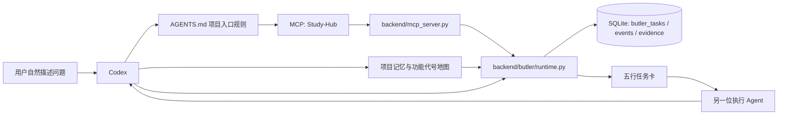
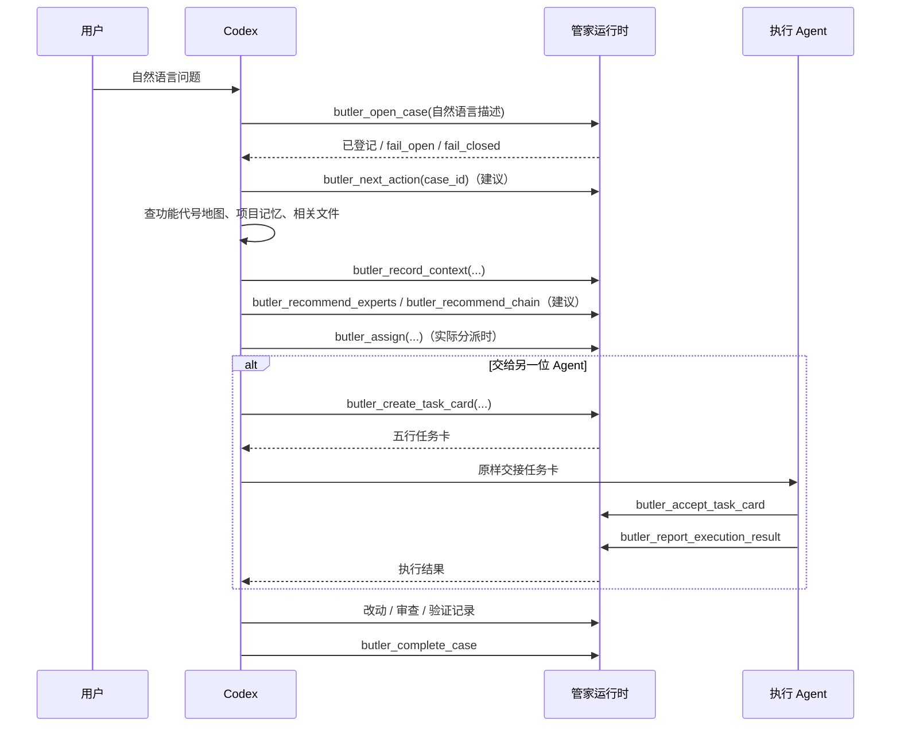

# Study-Hub 管家系统：运行逻辑与审查说明

> 文档用途：交给 Claude 做架构与实现审查。  
> 状态：按当前代码与项目规则整理，包含“已经实现”“已知限制”“建议改造”三部分；三者不可混淆。  
> 更新：2026-08-01

## 1. 产品目标

用户只在 Codex 中自然对话，不需要知道页面代号、前后端、内部角色或工具名。

管家的理想职责是：

1. 理解模糊问题并定位到项目记忆、功能代号和相关代码；
2. 把已确认事实压缩为简洁任务卡；
3. 将任务卡交给另一位执行 Agent；
4. 收回执行结果，完成审查、验证和经验沉淀；
5. 帮助 Codex 工作，而不是成为 Codex 的单点阻塞。

## 2. 当前架构



### 2.1 文件职责

| 文件 | 当前职责 |
|---|---|
| `AGENTS.md` | Codex 在本工作区的唯一行为规则来源：尽力登记、降级、确认、交接与验收。 |
| `.claude/skills/butler/SKILL.md` | Claude 适配说明与开发参考；不重复或覆盖 `AGENTS.md` 的行为规则。 |
| `.codex/config.toml` | 仅当前项目加载本地 Study-Hub MCP 服务。 |
| `study-hub/backend/mcp_server.py` | stdio MCP 服务；保留知识库等旧能力，并注册管家能力。 |
| `study-hub/backend/butler/models.py` | 任务类型、状态和状态流转规则。 |
| `study-hub/backend/butler/runtime.py` | 任务、确认、尝试、审查、验证、任务卡和记忆草稿的核心逻辑。 |
| `study-hub/backend/butler/storage.py` | SQLite 表和读写操作。 |
| `study-hub/backend/butler/mcp_tools.py` | 把运行时方法公开为 MCP 能力。 |
| `project-memory/功能代号地图.md` | 用户语言与功能位置的映射。 |

## 3. 当前真实运行流程

### 3.1 项目操作入口

当前 `AGENTS.md` 要求以下操作先进入管家：排查、修复、改动、新增、删除、检查、测试、发布、部署和项目研究。



### 3.2 任务类型（当前实现）

运行时内部保存以下标准值，但入口同时接受常用英文别名、中文标签和描述中的自然语言线索：

| 值 | 含义 |
|---|---|
| `bug` | 故障、异常、排查与修复 |
| `change` | 功能改动 |
| `research` | 外部方案研究 |
| `health_check` | 项目健康检查 |
| `deploy` | 发布、部署与上线检查 |
| `memory_update` | 项目经验更新 |

> 例如 `investigate`、`diagnose`、`排查`、`调查` 会归为 `bug`；省略类型时，运行时会按描述归类。火山引擎 ASR 案例可直接提交，无需猜测 `bug`。

### 3.3 状态流（当前实现）

```text
received → located → investigating → implementing → auditing → verifying → completed
                     ↘ awaiting_approval ↗
任意处理中状态 → blocked / cancelled
```

- `received`：已登记；必须先记录定位信息。
- `located`：已有项目记忆/领域文件定位；可分派处理角色。
- `investigating`：可记录调查尝试、生成任务卡或进入实施。
- `awaiting_approval`：受保护操作等待用户明确同意。
- `implementing`：记录实际改动后进入审查。
- `auditing`：填写六项检查后进入验证。
- `verifying`：按用户原始问题验证后可完成。

## 4. 项目记忆与任务卡

### 4.1 定位记录

`butler_record_context` 当前保存：

- `project_index_hits`：项目索引或功能代号地图命中；
- `owner_files`：相关领域知识文件；
- `memory_summary`：对当前任务有用的项目记忆摘要；
- `memory_sources`：记忆摘要的来源引用；
- `memory_freshness`：这组记忆的更新时间；
- `location_notes`：额外定位线索。

这些信息保存在任务自身的 `context_json`，不复制或自动改写项目记忆文件。任务处于 `located` 或 `investigating` 时可以继续追加线索，已有事实不会被覆盖。

### 4.2 任务卡

`butler_create_task_card(case_id, scope, acceptance)` 只能在已经定位的任务上使用。它将任务信息保存回同一个 `context_json`，并记录 `task_card_created` 事件。

输出固定为：

```text
【任务】...
【已知】...
【定位】功能代号 / 项目记忆 / 定位记录 / 相关文件 / 补充线索
【范围】...
【验收】...
```

规则：

- 只使用用户描述和已记录事实；
- 缺失的信息显示“待查”；
- `butler_get_task_card` 返回已保存的同一张卡；
- 卡片保存生成当时的事实快照、记忆来源与新鲜度；后续记忆不会静默改写旧卡。
- 卡片不直接启动另一个 Agent；执行者可认领卡片并回传结果，主 Agent 仍决定审查、验证和合并。

## 5. 角色与专家

目录中定义了内部角色：管家、需求展开、探索、架构、实现、审查、调试、体检、烟测。

领域专家包括自动化、前端、后端、部署和视觉。

`catalog.py` 还包含根据文本关键词推荐专家的 `resolve_experts()` 函数与任务链定义。

### 当前事实

运行时通过 `butler_recommend_experts` 和 `butler_recommend_chain` 真实调用推荐逻辑。两者均返回可采纳的只读建议；`butler_assign()` 仍只记录 Codex 最终实际采用的角色和专家，不会自动锁定或启动 Agent。

## 6. 已实现的安全与验收能力

- 删除、个人数据、账号权限、发布、部署等操作可以进入确认状态；
- 三次无进展尝试后，任务会停止；`failed`、`error`、`timeout` 等同样计入；
- 代码类任务完成前需要改动记录、六项审查和原始现象验证；
- 研究、体检、部署、记忆更新需要报告证据；
- 记忆只先生成草稿，用户确认后仍由明确写入操作完成。

## 7. 已解决项与保留边界

- **普通任务不再软阻塞**：MCP 普通错误返回 `policy: fail_open` 和补录指引；`AGENTS.md` 明确 Codex 可以继续低风险工作。确认类错误返回 `policy: fail_closed`。
- **任务分类不再要求猜固定英文值**：入口支持别名和自然语言归类；ASR 的 `investigate` 自动归为 `bug`。
- **调查可持续补充事实**：`record_context()` 在定位和调查阶段均可追加文件、记忆和线索。
- **推荐已接入运行时**：专家和任务链由真实 MCP 工具提供，但保持建议性质。
- **任务卡具备协作闭环**：执行 Agent 可以认领并回传结果，过程有事件留痕。
- **失败上限按无进展语义统计**：不再依赖精确 `failed` 字符串。
- **规则来源已收敛**：`AGENTS.md` 是 Codex 的唯一行为规则来源；Claude skill 是适配说明。

仍保留的有意边界：管家**不会自动创建 Codex 会话、抢占任务或自动合并改动**。若以后需要自动会话调度，应单独设计线程生命周期、并发、权限与结果合并策略，而不是把当前任务卡误称为自动调度。

## 8. 已实现的目标形态

管家现在是“辅助、可恢复、只在高风险处拦截”的系统：

```text
自然语言请求
  → 自动归类（不要求 Agent 猜英文值）
  → 建议定位与专家（可采纳、可覆盖）
  → 记录事实与任务卡
  → Codex/执行 Agent 自由调查和实施
  → 仅高风险操作必须确认
  → 收集审查与验证证据
```

已实现：自然语言归类、失败开放/关闭、可追加上下文、只读推荐、任务卡快照、认领和结果回收、强制高风险确认。自动创建会话仍是未来可选项目，不属于当前系统的承诺。

## 9. 验证现状

- 后端全量测试：50 项通过；
- 已完成一次真实 stdio MCP 启动验证；
- 已完成一次 MCP 适配器演练：`investigate → bug`、ASR → `automation-expert`、五行任务卡快照、认领、结果回收、`fail_open` 与 `fail_closed` 均有实际输出；
- `mcp_server` 已注册专家建议、任务链建议、任务卡认领和结果回收四项新工具；
- 本文的已实现项与保留边界均来自当前代码和测试，而非推测。

## 10. 请 Claude 重点审查的问题

1. 当前 fail-open/fail-closed 边界是否覆盖了所有高影响操作？
2. 自然语言分类的别名和关键词是否需要按真实任务记录继续调整？
3. 任务卡的认领与结果回收字段是否足够简洁且适合其他 Agent？
4. 何时才值得单独设计自动创建会话、并发和结果合并，而不是保持当前手动交接？
