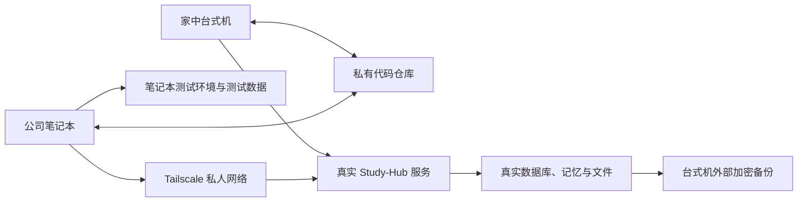

# Study-Hub 多地点开发设计

日期：2026-07-28
状态：设计已确认，等待用户复核书面版本

## 1. 目标

让同一位用户可以在家中台式机和公司笔记本之间持续开发 Study-Hub，同时满足：

1. 两台电脑都能取得最新代码并继续开发。
2. 家中台式机保存并运行唯一一份真实知识库、记忆、任务和检索数据。
3. 公司笔记本开发时只使用独立测试数据，不会污染真实数据。
4. 公司笔记本需要正常使用 Study-Hub 时，通过私人加密连接访问家中的真实服务。
5. 家中真实服务可以一键更新、失败恢复并定期备份。

## 2. 本次不处理

按用户要求，以下内容暂缓：

- 不轮换或迁移现有第三方服务密钥。
- 不清理 Git 历史中已经出现的密钥。
- 不补齐现有密钥的分发或密码管理流程。

已知风险：当前远端仓库是公开状态，历史代码中存在疑似真实密钥。暂缓处置不代表风险消失；实施过程中不得输出、复制或新增这些密钥，也不得把新的密钥写入仓库。

## 3. 方案选择

采用“代码同步、真实数据集中、开发数据隔离”的双轨方案。

不采用以下方案：

- 不用网盘实时同步整个项目目录。Git 工作目录、SQLite、Chroma 和运行日志不适合文件级双向同步。
- 不把全部工作改成远程桌面。远程桌面可以作为应急入口，但不是主要开发方式。
- 暂不把真实服务整体迁移到云服务器。家中台式机能够持续开机，现阶段没有必要增加迁移成本和持续费用。

## 4. 总体蓝图

## 5. 功能边界

### 5.1 代码仓库

负责源码、锁定文件、测试、脚本、配置模板和项目说明。

不负责真实数据库、向量索引、用户上传文件、日志、进程文件、运行环境目录和本机配置。

### 5.2 家中真实服务

负责对真实知识库、记忆、任务、文件和向量索引的全部读写。真实数据只允许该服务进程访问，不通过共享磁盘暴露给笔记本。

### 5.3 笔记本开发环境

负责代码编辑、自动测试、前后端本地运行和测试数据。其数据根目录与真实数据目录必须不同，且启动脚本需要主动验证隔离状态。

### 5.4 私人连接

负责让笔记本访问家中的网页服务。只允许已授权设备和账号进入，不开放公网入口，不配置路由器端口映射。

### 5.5 备份与恢复

负责生成真实数据的一致快照、保留多个恢复点并验证可恢复性。备份目录必须在 Git 仓库之外。

## 6. 具体选型

### 6.1 代码同步

- 使用现有 GitHub 仓库，改为私有仓库。
- `main` 只保存经过验证、可部署到家中真实服务的版本。
- 每项开发使用独立分支；换电脑前必须提交并推送。
- 未完成工作使用说明清楚的临时提交交接，不使用只存在本机的 stash 作为跨设备交接手段。
- 拉取代码只允许快进；发现两端分叉时停止自动更新并人工处理。

### 6.2 私人连接

- 台式机和笔记本安装 Tailscale，并登录同一私人网络。
- 家中 Study-Hub 只监听 `127.0.0.1`。
- 使用 Tailscale Serve 将家中本地服务提供为私人 HTTPS 地址。
- 禁止使用 Tailscale Funnel，禁止把 8741 端口直接暴露到公网。
- 第一阶段依赖 Tailscale 的用户和设备身份控制访问；应用内第二重登录与现有密钥处置一起暂缓。

### 6.3 真实服务

- 保留现有 FastAPI、SQLite 和 ChromaDB，不迁移到新的数据库产品。
- 前端构建产物由现有后端提供，远程使用时保持前后端同一地址。
- 生产前端使用相对数据地址，移除页面中写死的 `localhost:8741`。
- 生产环境不允许任意来源跨站访问，也不把内部异常详情返回浏览器。

### 6.4 笔记本开发环境

- 增加统一初始化脚本，检查 Git、Node、Python 3.12，并创建本地运行环境、安装依赖和生成测试配置。
- 增加统一开发启动脚本，同时启动本地后端和前端。
- 测试数据放在仓库忽略的独立目录，不从家中真实数据自动复制。
- 自动测试统一使用临时目录，结束后可以完整删除。

### 6.5 家中更新

增加“一键更新真实环境”脚本，固定执行顺序：

1. 确认当前分支是 `main`，工作区没有未提交内容。
2. 确认远端更新可以快进，拒绝强制覆盖。
3. 在独立准备目录取得候选版本，安装依赖、运行代码测试并完成前端构建。
4. 候选版本验证通过后，停止真实服务并生成数据快照。
5. 将真实运行目录切换到已验证的候选版本。
6. 启动真实服务并检查健康状态与核心页面。
7. 失败时恢复旧代码和更新前数据快照。

该脚本第一阶段由用户在台式机手动运行，不设置无人值守的自动部署。

## 7. 配置约定

新增配置采用以下约定；实现前不得改变字段含义：

| 配置 | 取值 | 含义 |
|---|---|---|
| `STUDY_HUB_MODE` | `development` 或 `production` | 当前运行身份，必须显式设置 |
| `STUDY_HUB_DATA_DIR` | 绝对目录 | 当前实例的数据根目录，必须位于仓库忽略范围 |
| `STUDY_HUB_BACKUP_DIR` | 绝对目录 | 真实环境备份位置，必须在仓库外 |
| `HOST` | `127.0.0.1` | 本机监听地址 |
| `PORT` | `8741`，可覆盖 | 本机服务端口 |
| `VITE_API_BASE` | 开发时 `/api`，生产时空值 | 浏览器访问数据服务的基础地址 |

启动边界：

- 缺少 `STUDY_HUB_MODE` 或 `STUDY_HUB_DATA_DIR` 时拒绝启动，不隐式猜测。
- `development` 指向登记的真实数据目录时拒绝启动。
- `production` 只能由家中生产启动脚本设置。
- 生产和开发实例同时运行时必须使用不同端口与不同数据目录。

## 7.1 关键操作约定

| 操作 | 输入 | 成功结果 | 失败约定 | 边界与副作用 |
|---|---|---|---|---|
| 初始化笔记本 | 项目目录，可选开发端口 | 返回成功状态；本地依赖和测试目录就绪 | 返回非零状态并指出缺少的软件或失败步骤 | 可重复执行；只创建本地依赖、测试配置和测试目录，不启动真实服务 |
| 启动本地开发 | `development` 身份、测试数据目录、开发端口 | 本地健康检查返回 `status=ok` 和 `mode=development` | 配置缺失、端口占用或目录越界时拒绝启动 | 只读写测试目录；不会创建或修改真实数据目录 |
| 更新家中服务 | 固定目标 `main`、生产数据目录、备份目录 | 候选版本通过验证，真实服务切换成功且健康检查通过 | 任一步失败都返回非零状态；切换前失败保持当前服务，切换后失败恢复旧版本 | 会创建候选准备区和更新前快照；不得强制覆盖本地改动或远端历史 |
| 生成真实备份 | 生产数据目录、仓库外备份目录 | 生成带时间、版本和文件校验值的完整恢复点 | 任一必需文件无法读取时整次失败，不产出“成功”标记 | 短暂停止真实写入；不包含 PID、普通日志和构建产物 |
| 恢复真实备份 | 已验证恢复点、空的临时恢复目录 | 先在临时目录校验，再原子切换为恢复数据 | 校验、空间或启动检查失败时保留当前真实数据 | 覆盖真实数据属于高风险操作，执行前必须二次确认并另存当前快照 |

新健康检查返回固定字段：`status` 为 `ok` 或 `error`，`mode` 为 `development` 或 `production`，`version` 为当前代码版本。健康检查不得返回路径、密钥、异常堆栈或个人数据。

## 8. 数据流

### 8.1 代码交接

当前电脑提交并推送开发分支，另一台电脑拉取同一分支后继续。完成后通过检查和合并进入 `main`。真实环境只从 `main` 更新。

### 8.2 笔记本本地开发

浏览器请求进入笔记本本地前端，再由本地后端读写测试目录。整个路径不访问 Tailscale 地址，也不读取真实数据目录。

### 8.3 公司使用真实资料

笔记本浏览器访问 Tailscale 私人 HTTPS 地址，请求到达家中台式机的真实服务，再由真实服务读写本机数据。数据库文件不会离开台式机。

### 8.4 发布新版本

已验证代码合并到 `main` 后，家中台式机运行更新脚本。更新脚本先验证和备份，再切换代码；健康检查失败则恢复。

### 8.5 数据备份

真实服务停止写入后，将以下内容作为同一恢复点保存：

- `backend/data/` 中的主数据库、Chroma、图片、Wiki、收件箱和业务文件。
- `second-self/.memory/` 中的记忆数据库。
- Second Self 中用户维护的 Markdown、原始资料和状态文件。

不备份 `server.pid`、普通运行日志、临时下载和可重新生成的构建产物。默认保留最近 7 份每日备份和 4 份每周备份。

## 9. 安全防线

### 9.1 浏览器与操作层

- 开发界面明确显示测试环境状态，避免把测试窗口误认为真实环境。
- 真实环境中的删除、批量覆盖和恢复操作必须二次确认。
- 连接中断、无数据和服务器错误必须显示明确状态，不静默失败。

### 9.2 服务逻辑层

- 服务端重新验证运行身份和数据目录，不信任浏览器传入的环境标记。
- 真实环境写操作记录时间、操作类型和目标，不记录密钥或完整隐私正文。
- 数据迁移和批量修改必须能在失败时回滚。
- 家中更新脚本发现未提交改动、测试失败、备份失败或分支分叉时立即停止。

### 9.3 数据与运行层

- 真实数据不进入 Git，不通过共享目录或同步盘提供给笔记本。
- SQLite 只允许家中真实服务单点写入；笔记本不得直接打开该数据库。
- 生产服务只监听本机，再由 Tailscale Serve 提供私人连接。
- 每次更新前必须生成一致快照，并定期执行实际恢复演练。

## 10. 故障处理

| 故障 | 处理方式 |
|---|---|
| 家中断网或关机 | 笔记本继续本地开发；真实资料暂时不可用，不启用陈旧副本写入 |
| Tailscale 未连接 | 显示真实服务不可达；不得自动切换到测试数据冒充真实数据 |
| 两台电脑代码分叉 | 停止拉取或更新，保留双方提交后人工合并 |
| 家中工作区有未提交内容 | 一键更新拒绝执行 |
| 测试或构建失败 | 不停止当前真实服务，不发布新版本 |
| 数据备份失败 | 不执行数据迁移或版本切换 |
| 新版本健康检查失败 | 恢复旧代码和更新前数据快照，再启动旧版本 |
| SQLite 锁定 | 返回可理解的繁忙提示并有限重试，不复制数据库文件绕过锁 |
| Chroma 索引异常 | 从主数据库和原始文件重建索引；Chroma 不作为唯一事实来源 |
| 台式机重启 | Tailscale 和 Study-Hub 通过 Windows 计划任务自动恢复，并执行健康检查 |

## 11. 验证计划

### 11.1 自动检查

- 配置检查：缺少运行身份或数据目录时必须启动失败。
- 隔离检查：开发模式指向真实目录时必须启动失败。
- 双实例检查：生产和开发实例可以使用不同端口、不同临时目录运行。
- 数据保护检查：完整运行笔记本测试后，真实数据目录哈希保持不变。
- 地址检查：构建后的前端不再包含业务请求用的固定 `localhost:8741`。
- 仓库检查：个人数据库、日志、进程文件和运行目录不再被 Git 跟踪。
- 更新检查：脏工作区、分叉、测试失败和备份失败都会阻止更新。
- 恢复检查：模拟启动失败后，旧版本重新通过健康检查。

### 11.2 人工验收

1. 在一台干净的笔记本环境中取得项目并运行统一初始化脚本。
2. 用测试数据新增、修改和删除内容，确认家中真实数据没有变化。
3. 通过 Tailscale 私人地址访问家中真实 Study-Hub 并完成一次正常读写。
4. 在笔记本提交代码，台式机拉取后继续开发。
5. 将通过验证的版本合并到 `main`，执行家中一键更新。
6. 人为制造一次启动失败，确认旧版本自动恢复。
7. 随机选择一份备份恢复到临时目录，验证数据库、记忆、图片、Wiki 和检索功能。

## 12. 实施阶段

### 阶段 0：隐私与仓库边界

- 将 GitHub 仓库设为私有。
- 停止跟踪 `second-self/.memory/`、运行日志和其他个人数据。
- 在仓库外制作个人数据备份。
- 清理数据库历史属于改写远端历史的破坏性操作，实施时必须再次取得用户明确确认。
- 现有第三方密钥按用户要求不处理。

### 阶段 1：可重复的本地开发

- 建立统一配置解析和数据目录隔离。
- 建立笔记本初始化、开发启动和停止脚本。
- 消除启动脚本和前端业务请求中的机器固定路径。
- 补充隔离与启动测试。

### 阶段 2：家中真实服务

- 建立生产启动、停止、健康检查和开机恢复。
- 让后端提供构建后的前端，并统一使用相对地址。
- 收紧生产来源和错误输出。

### 阶段 3：私人访问

- 配置 Tailscale 设备与访问规则。
- 配置 Tailscale Serve，仅提供私人 HTTPS 地址。
- 从笔记本验证真实服务访问，不开放公网。

### 阶段 4：更新、备份与恢复

- 建立一键更新脚本和失败恢复。
- 建立每日与每周备份保留策略。
- 执行一次完整恢复演练并记录结果。

## 13. 完成定义

以下条件全部满足才算完成：

1. 两台电脑能通过私有仓库交接代码。
2. 笔记本可以一键准备并运行测试环境。
3. 笔记本测试无法读写真实数据目录。
4. 笔记本可以通过私人地址使用家中真实服务。
5. 家中服务不直接暴露公网端口。
6. 家中版本可以一键更新并在失败时恢复。
7. 备份已通过实际恢复验证。
8. 个人数据库和运行文件不再出现在新的 Git 提交中。
9. 现有启动脚本相关未提交改动被保留并纳入后续实施评估。
